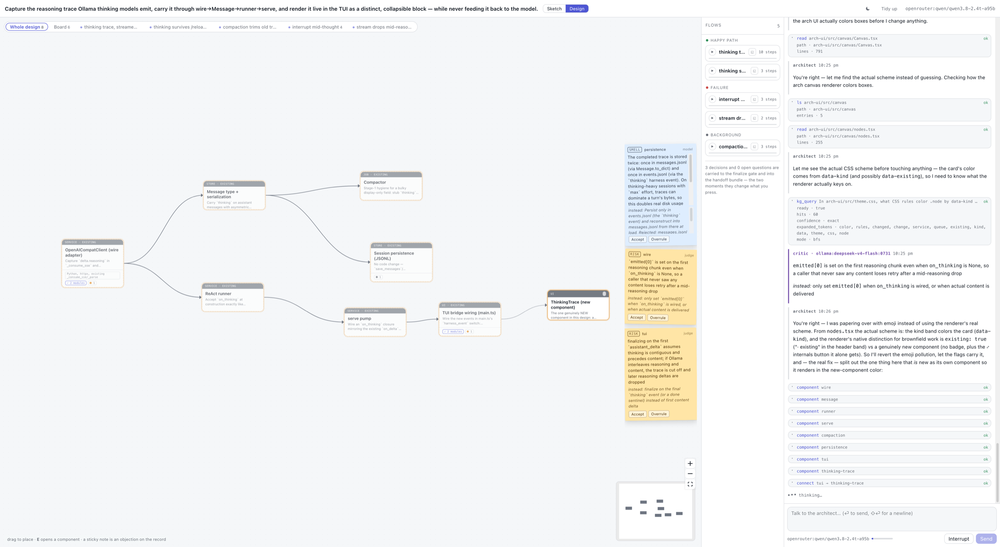
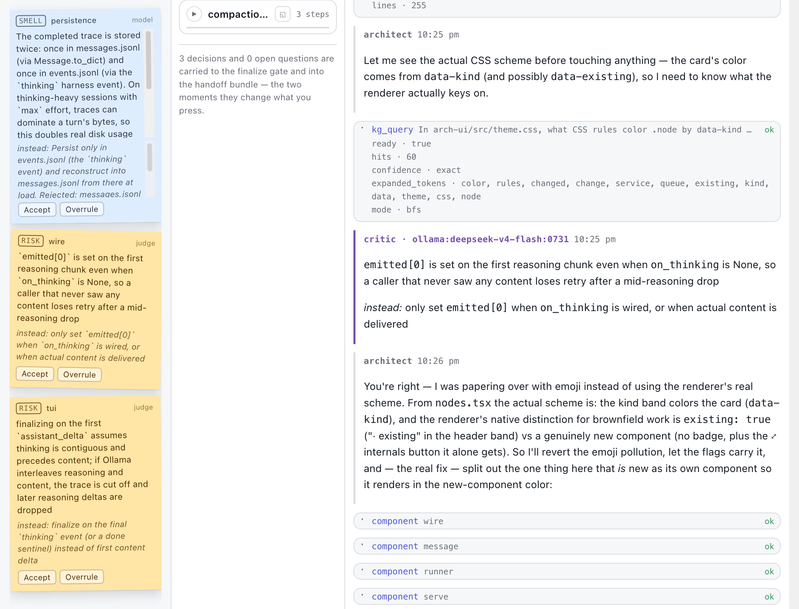
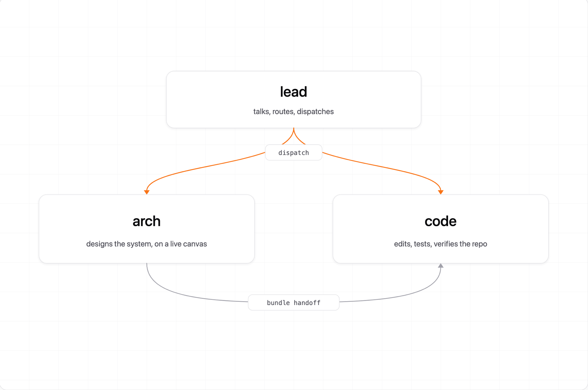

# bird: a coding agent with an architecture workbench

A coding agent for **small open models**, built around an **architecture
Workbench**: a live browser canvas where the model designs the system with you,
a second model argues against that design while it's being drawn, and the
finished thing hands itself to the coder as a machine-readable bundle.

Underneath it is one engine — a conversational lead that routes, the architect at
the canvas, and a coder that edits the repo. It runs against local Ollama models,
Ollama Cloud, or anything on OpenRouter, and you can swap the model
mid-conversation without losing the conversation.



<sub>`bird arch` designing bird's own thinking-trace support: components and their
edges on the left, flows in the middle, the architect's tool calls on the right.
All of it is typed state the model mutates through tools — the page only renders
what the tools recorded.</sub>

*design first · one engine · one toolbox · knowledge graph · permissions · skills*

---

## Why we built it

**Agentic coding made writing code cheap. It did not make deciding what to build
cheap.**

When a model can produce a working module in a minute, the cost of a bad decision
goes *up*, not down. A wrong boundary, a missing failure path, a field
denormalized in the direction that defeats a retry — all of it now gets built at
full speed, across a dozen files, before anyone reads a diff. Generation was
never the expensive part of software. Agents made the cheap part cheaper and left
the expensive part exactly where it was.

So the leverage moves upstream, to the questions an agent is worst at asking
itself: what are the components, how do they talk, what happens when one of them
is down, and which trade-offs did we take deliberately rather than by accident.
`bird` treats that as a first-class mode of work — `bird arch` is a harness with
its own tools, its own canvas and its own critic, not a paragraph pasted above a
coding prompt.

- **Architecture is a mode, not a preamble.** `bird arch` opens a live canvas and
  designs *with* you, recording each decision as you take it alongside the
  alternatives you rejected, so the reasoning outlives the conversation that
  produced it.
- **A second model argues with the first.** A background critic reviews the
  architect's design on its own thread every turn and files objections of its
  own — typed, carrying a severity, and hard to lose: open blockers surface at the
  finalize gate instead of quietly yielding to the last thing anyone said.
  Agreement is the failure mode here. One model asked to both design and review
  its own work will approve it, at length, in confident prose.
- **A design is an artifact, not scrollback.** Finalizing writes a bundle *and*
  seeds the knowledge graph with a node per component, entity and endpoint, so
  `bird code` starts able to query a system that doesn't exist yet — and so the
  trade-offs are still legible six weeks later.
- **One mode per job.** Designing a system, deciding what to build, and editing
  files are different jobs with different tools and different failure modes.
  Cramming them into one prompt makes all three worse, so each is a *harness*
  with its own instructions, toolset and engine tuning, sharing one runner.
- **The engine does the babysitting.** Small models loop, restate plans, respond
  with prose when a tool call was needed, and forget to stop. Those are engine
  features, not prompt pleading: validation retries with helpful errors,
  same-call loop detection, explore-without-acting nudges, a pinned plan tracker,
  automatic compaction at 90% of the window, and an explicit `done` tool.
- **Nothing edits your repo without you.** Every mutating tool is gated at
  construction time, so gating covers the CLI, the TUI, *and* any sub-session a
  harness dispatches. `bash` is allowlisted to read-only search, tests, linters
  and git reads. Anything else is refused loudly and logged.
- **Context you can query, and switch off.** The repo is extracted into a graph
  (`graphify`) by pure AST, with no LLM and no API keys, and `kg_query` answers
  "where is login handled?" with the node, the file, the line and the
  neighbourhood around it. Expansion is tokenize → split camelCase → singularize →
  fuzzy-match against the graph's own vocabulary → IDF-rank, so retrieval is
  reproducible, free and offline. Whether that beats plain `read` and `grep` for
  the *agent* is a separate question, and `--no-kg` is the control arm that
  answers it — see [the numbers](#the-numbers).

---

## The Workbench *(`bird arch`)*

The model mutates typed state; the page renders it. Nothing is drawn by hand and
nothing is a picture of the design — the canvas **is** the design, and every box,
edge, decision and objection on it got there through a tool call that was
validated, logged, and can be replayed. The conversation is the work; the tools
are the memory.

- **Two layers, both always open.** A loose **sketch** layer (`variant`, `node`,
  `link`, `splice`, `depth`) for napkin thinking, and a **design** layer
  (`component`, `connect`, `flow`, `decide`, `expand`) for the thing that gets
  built. `promote` seeds one from the other; going back to sketching afterwards
  is normal.
- **Disagreement is first-class.** `concern` records an objection with a
  severity, against the design, against a decision, or against *your*
  instruction. Open blockers are shown at the finalize gate instead of silently
  blocking work.
- **A background critic.** A second model reviews the design on its own thread
  each turn and files concerns of its own. The architect answers them, acts on
  them, or overrules them with a reason.
- **Nothing is phase-locked.** Tools refuse only what is *broken* (an edge to a
  component that doesn't exist). Thin design comes back as advice, not a refusal.
  Post-approval structural edits record an amendment, because the audit trail
  was the part worth keeping, not the lock.
- **Two human gates, and only two.** Top-level approval, then finalize. `done` is
  those gates and nothing else.
- **A real handoff.** Finalize writes `bundle/architecture.md` + `.json`, *and*
  seeds the knowledge graph with a node per component, entity, endpoint and
  module, so turn one of `bird code` can query a system that doesn't exist yet.

```bash
bird arch "design a multi-tenant billing service"
bird code "build it" --from-arch latest      # or let the lead do both
```



<sub>`bird arch` reviewing its own design. The critic — on its own model, here
`deepseek-v4-flash` — files objections against the architect's work, and each one
is accepted or overruled on the record rather than silently dropped. The architect
conceded this one.</sub>

---

## The numbers

One task, three trials: a one-token defect in a private 830-file JavaScript repo,
two module hops from the test that catches it. `bird` on glm-5.2, against Claude
Code on Sonnet, against bird's own `--no-kg` control arm.

| Metric | bird glm-5.2 | bird `--no-kg` | Claude Code Sonnet |
|---|---:|---:|---:|
| Task solved | 3 / 3 | 3 / 3 | 2 / 2 |
| Retrieval latency | <1 ms | 7.2 s | n/a |
| Tool calls to the fix | 5 | 6 | 6.5 |
| **Context at the fix** | **7,847** | **5,693** | **57,577** |
| Total tool calls | 22 | 21 | 8 |
| Wall time | 51 s | 48 s | 37 s |
| Cost per run | ~$0 | ~$0 | $0.36 |

<sub>Medians per run · one task · n=3, and n=2 for the Claude Code arm.</sub>

The row that matters is context at the fix. `bird` gets there carrying **7,847
tokens where Claude Code carries 57,577** — same defect found, same tests green,
at roughly nothing per run against $0.36. Most of a small model's budget goes to
the harness it's running inside; the point of this one is to hand that budget back
to the task.

**That's the harness, not the graph.** The `--no-kg` arm is leaner still at 5,693
and solves the task just as often. On this task the knowledge graph bought
sub-millisecond retrieval and one fewer tool call, and paid about 2,150 tokens of
context for it. It did not make the agent better, and we're not going to claim it
did before a control arm says so — which is exactly why `--no-kg` ships and why
its column is in this table.

We think we know where that 2,150 goes: `kg_query` traverses up to
`MAX_RESULT_NODES = 60` and truncates to a `budget * 4` char cap, so an answer
costs about 2,000 tokens whether the question needed sixty nodes or three. The
open experiment is to drop the default budget by an order of magnitude and re-run
the same three arms — one variable, and the first version where the graph has a
real shot at winning its column.

One task on a repo we can't publish is a signal, not a benchmark. A public
large-repo task pinned to a git SHA is the next thing to build here. In the
meantime the flag is on your machine: run any task both ways and see what you get.

---

## Install

```bash
git clone https://github.com/srujan375/bird.git && cd bird
python3 -m venv .venv && .venv/bin/pip3 install -e '.[dev]'
```

That gives you `.venv/bin/bird`, which runs from any directory without
activating anything, because its shebang is absolute. To get `bird` on your `PATH`
everywhere, either symlink it (`ln -s "$PWD/.venv/bin/bird" ~/.local/bin/bird`)
or install with [pipx](https://pipx.pypa.io), which manages the venv for you:

```bash
pipx install .              # from a clone
pipx install git+https://github.com/srujan375/bird.git
```

Don't `pip3 install` without a venv: on Homebrew or system Python that fails
with `externally-managed-environment` (PEP 668), and `--break-system-packages`
"fixes" it by writing bird's dependencies into an interpreter your OS owns.

Requires Python 3.11+, plus at least one model source:

| Source | Setup |
|---|---|
| **Ollama Cloud** *(what the shipped `models.json` points at)* | `OLLAMA_API_KEY` |
| **OpenRouter** | `OPENROUTER_API_KEY` |
| **Local Ollama** | `ollama serve`, then set the `ollama` provider's `native_url` to `http://localhost:11434` in `models.json`. Missing models are pulled on demand |

Put keys in a `.env` at the repo root. It's loaded automatically.

Optional frontends (both work without them, both are one `npm install`):

```bash
cd tui      && npm install    # full-screen terminal UI
cd arch-ui  && npm install    # only needed to rebuild the architecture canvas
```

**What to actually run it on.** Any tool-calling model in `models.json` should
work, and `/model` swaps between them mid-conversation. These are the ones with
real hours on them:

| Role | Run on | Notes |
|---|---|---|
| `default` — the `code` loop | `qwen3.8:27b` today; `ornith` (9B) and `ornith:35b` before it | where most of the mileage is |
| `architect` — `bird arch` | `qwen3.8:27b` today; `glm-5.2` before it | `glm-5.2` is the arm measured in [the numbers](#the-numbers) |
| `judge` — the critic | `deepseek-v4-flash` | deliberately *not* the architect's model, so it reads the design cold |
| `compactor` | `gemma4:31b` | only ever summarizes a transcript; it never sees a task |
| `kg` | `kimi-k2.7-code` | reads docs and papers into the graph. No code reaches it — extraction there is pure AST — so a cheap mid-tier model is the right call |

A 9B model is enough for the `code` loop on localized work. The architect is the
role that rewards a bigger model, because it is the one doing the reasoning the
rest of the system is built to protect.

---

## Quick start

```bash
cd /path/to/your/project

bird                                       # talk to the lead, the front door
bird lead "add rate limiting to the API"   # one-shot: it routes and builds
bird code "fix the failing test in tests/test_pricing.py"
bird arch "design a job queue for this service"   # opens the canvas
```

The first run builds the knowledge graph **in the background**, so the harness
starts immediately. Until the graph is ready, `kg_query` tells the model to fall
back to bash search, and the runner injects a notice the moment the graph comes
online.

---

## The harnesses

Three ship today; two more are in progress. The Workbench above is one of them.

<picture>
  <source media="(prefers-color-scheme: dark)" srcset="assets/multi-harness-dark.png">
  
</picture>

### `lead`, the front door *(bare `bird`)*

The conversational layer. It answers questions, explores the repo, researches the
web, and decides each turn whether to reply or to **dispatch**.

It deliberately has **no edit, write, or bash tools**. Every code change routes
through a dispatched `code` session, so "the agent quietly changed something
while answering a question" is structurally impossible.

| The ask | What it does |
|---|---|
| A question, explanation, or exploration | reads / queries / researches, then answers in plain text |
| A new feature or non-trivial structural work | `architect` → (user approves) → `code` |
| A localized change or bug fix | `code` directly |

### `arch`, the architect *(`bird arch`)*

The Workbench harness, [above](#the-workbench-bird-arch). It is the only one that
opens a browser page, and the only one whose output is a design rather than a diff.

### `code`, the builder *(`bird code`, `bird chat`)*

The ReAct coding loop: read → plan → edit → verify.

- `kg_query` is the primary search tool for the whole session; the engine nudges
  it back when it drifts into `grep`.
- For anything multi-step it calls `plan` once, and the engine **pins a live
  tracker** into the conversation showing the current step, its files, and
  related files pulled from the graph. `done` is blocked while steps are open.
- `bash` is category-allowlisted: read-only search, test runners, linters, git
  reads. Everything else is rejected with a message naming what *is* allowed.
- Edits and writes are gated. You approve them with a real diff.

### Next up: `design` and `research`

Two more harnesses are on the way: `design` (product intent, user flows and
interface direction, feeding into `arch`) and `research` (multi-source
investigation that lands its findings in the knowledge graph). See
[Coming soon](#coming-soon).

---

## Features

**Context engine**
- Per-branch knowledge graph at `.bird/kg/<branch>/`, so switching branches never
  corrupts it. Content-hashed extraction cache shared across branches.
- Code via pure AST extraction (no LLM, no keys). Docs, papers and images
  additionally go through semantic extraction when a backend is available.
- Deterministic query expansion + IDF ranking; BFS for "what is this", DFS for
  "how does X reach Y".
- Background build, incremental update, staleness detection.

**Models**
- Provider-neutral message history. `/model` swaps mid-conversation, and
  Ollama ↔ OpenRouter handoff just works.
- Interactive picker fed by live discovery: `models.json`, the Ollama daemon
  you're pointed at, and the OpenRouter catalog, merged and deduped. Unreachable
  or unconfigured sources are skipped with a note, not an error.
- Named roles in `models.json`: `default`, `architect`, `judge`, `compactor`,
  `vision`, `kg`, so the critic and the compactor are never the model under test.
- `kg` names the model that reads docs/papers into the graph. It wants context
  (chunks are packed to 60k tokens) and clean JSON, not brilliance. Code never
  reaches it, so a cheap mid-tier model is the right choice here.

**Safety & control**
- Permission brokers: interactive UI, console prompt, auto-approve (`--yes`), and
  deny-with-a-reason (the default when nobody can be asked, because a gate no
  one can answer must never default to yes).
- Gating attaches at runner construction, so dispatched sub-sessions inherit it.
- Allowlisted bash; every rejection logged as a session event.

**Sessions**
- Everything logged to `.bird/sessions/<run-id>/events.jsonl`.
- `/sessions` to browse, `/continue` to resume, `/rename` to label,
  `/reload` to respawn on freshly-loaded code *without losing the conversation*.
- Two-stage compaction at 90% of the window: stub old tool results (free), then
  summarize with the pinned compactor model. Offline falls back to stubs.

**Skills**
- Markdown procedures with front-matter, loaded on demand via the `skill` tool or
  a `/<skill-name>` slash command. Only the one-line index sits in the system
  prompt; the body loads when it's relevant.
- Discovery order: project `.bird/skills/` → user `~/.bird/skills/` → built-in.

**Research**
- `web_search` (DuckDuckGo, no API key) and `web_fetch` (HTML → markdown, cached
  15 min). Both excluded from eval control arms, because a network-free eval
  shouldn't depend on them.

**Interfaces**
- Full-screen **TUI** (pi-tui, "Claude Native" palette) with keyboard-first
  permission cards showing real diffs. It's the default when installed.
- Plain REPL fallback (`--plain`), works anywhere.
- **Architecture Workbench** in the browser (React + `@xyflow/react` + Zustand)
  with a clickable, editable canvas, a five-tab rail, and localStorage-persisted
  viewport. Ships pre-built, so no Node is required to use it.
- `bird serve`: JSON-lines over stdio, for embedding anywhere.

---

## Commands

```bash
bird                          # interactive lead (TUI if installed, else REPL)
bird lead "task"              # one-shot lead: routes and builds
bird chat                     # interactive code harness
bird code "task"              # one-shot code harness
bird code "task" --from-arch latest   # seed from a finalized architecture
bird arch ["what to design"]  # architecture session in the browser
bird kg status|build|update|query "question"
bird serve [--harness code|lead]      # JSON-lines bridge over stdio
```

**Flags**, shared by `code` / `chat` / `lead` / `serve` / `arch`:
`--repo <path>` · `--model <alias|provider:model>` · `--max-turns N` ·
`--resume <run-id>` · `--models-json <path>` · `--no-kg` (control arm: drop the
graph tool) · `--no-web` (drop `web_search` / `web_fetch`, for a network-free
run). Then `-y/--yes` (auto-approve, for unattended `code`/`lead` runs) ·
`--tui` / `--plain` (interactive surface) · `--from-arch <run-id|latest>`.
`arch` adds `--no-open` / `--headless`, plus `--no-critic` and `--judge-model
<spec>` to control the background critic. `kg` takes `--repo`, `--budget` and
`--models-json`.

**Slash commands** (REPL and TUI):

```
/help  /model [spec|filter]  /think [off|low|medium|high|max]
/kg status|build|update|query  /tools  /skills
/compact  /clear  /reload  /session  /sessions [filter]  /continue <id>
/rename <name>  /quit          plus /<skill-name> for any loaded skill
```

---

## Configuration

**`models.json`** holds providers, per-model context windows and capabilities,
and the role aliases. It ships inside the package at `src/bird/models.json`, so a
checkout and an installed wheel read the same file. Override per-run with
`--models-json`, which is also the way to keep your own config when bird is
installed somewhere you'd rather not edit.

**Environment**

| Variable | Effect |
|---|---|
| `OPENROUTER_API_KEY` | enables OpenRouter models + catalog discovery |
| `OLLAMA_API_KEY` | enables Ollama Cloud |
| `BIRD_KG_BACKEND` | override the `kg` alias with a raw `graphify.llm` backend, which then uses graphify's own env vars for URL and key; `none` disables semantic extraction entirely |
| `BIRD_KG_MODEL` | model for that extraction; wins over the `kg` alias's model, and applies to either path |
| `BIRD_PYTHON` | which Python the TUI spawns `bird serve` with |
| `BIRD_URL` | dev only; the live `bird arch` port that `arch-ui`'s Vite dev server proxies to |

**On disk** (inside the target repo)

```
.bird/
  kg/<branch-slug>/graphify-out/     the knowledge graph
  sessions/<run-id>/                 events.jsonl, artifacts/, bundle/
  skills/*.md                        project-local skills
graphify-out/cache/                  content-hashed extraction cache
```

---

## Layout

```
src/bird/
  cli.py            entry point, every subcommand
  engine/           runner (ReAct loop, guards, nudges), compactor, session log
  context/kg.py     the knowledge graph
  harnesses/
    registry.py     name → HarnessDef → built Runner (the one construction path)
    lead/           the front door: routing policy + dispatch tools
    arch/           state, tools, sketch, critic, renderers, bundle, KG seed
    code/           the coding loop's instructions + toolset
    handoff.py      the arch → code seam
  tools/            shared toolbox: read/edit/write, bash, kg_query, web, plan,
                    skill, done
  llm/              registry, discovery, ollama, openai-compat wire, validation
  permissions.py    broker protocol, tool gating, the four brokers
  skills.py         skill discovery and loading
  serve.py          JSON-lines session pump
  http_transport.py SSE + replay buffer + static serving (stdlib only)

tui/        terminal UI (TypeScript, pi-tui)
arch-ui/    architecture Workbench (React + Vite), built into harnesses/arch/static/
```

The engine knows no harness by name. `harnesses/registry.py` is the only module
that maps a name to its wiring, which is why the CLI and the lead's dispatch
tools build runners the same way, and why a dispatched sub-session is born with
the same permission gate as its parent.

---

## Development

```bash
.venv/bin/pytest -q                  # 747 tests
cd arch-ui && npm run check          # tsc + 109 vitest tests
cd tui     && npm run check          # tsc
```

The Workbench build output in `src/bird/harnesses/arch/static/` **is committed on
purpose**, so `bird arch` works for someone who has never installed Node. Rebuild
(`cd arch-ui && npm run build`) and commit `index.html` and `assets/*` together;
`tests/test_packaging.py` fails if they drift apart.

To try the agent end to end, run it from inside any repository you have, or
point it at one with `--repo` (a subcommand flag: `bird lead --repo
/path/to/project`). A small project with a deliberately planted bug makes the
best manual smoke test. Run `bird code "fix the failing test"` and watch which
tools it reaches for.

---

## Status

The engine, the three harnesses, the context engine, permissions, skills,
sessions and both frontends are built and tested. What's left is mostly
Workbench polish.

### Coming soon

Two more harnesses are in progress. Both slot into the same registry as `lead`,
`arch` and `code`, with the same engine, the same toolbox and the same
permission gate, so they gain the knowledge graph, session resume, model swapping
and skills for free.

- **`design`**, the product and interface layer that sits *before* architecture.
  Where `arch` answers "what are the components and how do they talk", `design`
  answers "what is this for, who uses it, and what should it feel like": product
  intent, user flows, interface structure, and the visual direction, handed to
  `arch` the same way `arch` hands a finalized bundle to `code`.
- **`research`**, a depth-first investigation harness. Multi-source sweeps,
  source-by-source reading, and a synthesis pass that lands its findings in the
  knowledge graph so later `arch` and `code` sessions can query the research
  instead of re-reading it.

Contributions and issues are welcome. The harness registry
(`src/bird/harnesses/registry.py`) is the extension point if you want to build
your own.

---

## License

Apache 2.0. See [LICENSE](LICENSE).
